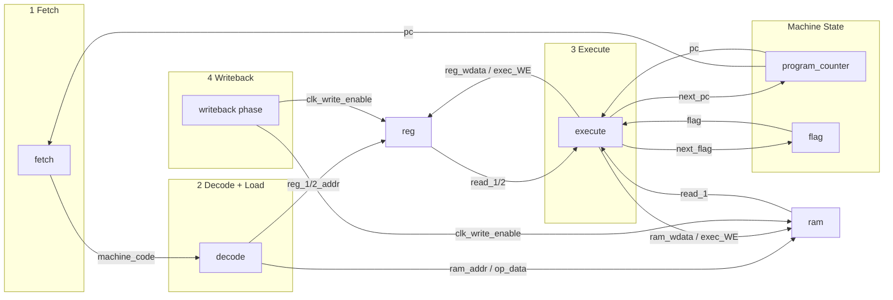

# CPU15 - FPGA CPU Implementation

FPGA上で動作する15ビットマシンコードを実行するCPUの実装．[『動かしてわかるCPUの作り方10講』](https://www.amazon.co.jp/%E5%8B%95%E3%81%8B%E3%81%97%E3%81%A6%E3%82%8F%E3%81%8B%E3%82%8B-CPU%E3%81%AE%E4%BD%9C%E3%82%8A%E6%96%B910%E8%AC%9B-%E4%BA%95%E6%BE%A4-%E8%A3%95%E5%8F%B8/dp/4297108216)の8講までの内容を実装している．

## ディレクトリ構成

```
cpu15/
├── main.vhd                    # トップレベルエンティティ
├── components/                 # その他のコンポーネント
│   ├── clk_enable_gen.vhd     # フェーズ（fetch,decode...）分割のためのクロックイネーブル生成器
│   ├── reset_sync.vhd         # リセット信号同期化
│   └── constants.vhd          # 定数定義
├── control_flow/              # CPU制御フロー（load/writebackは後述のdevices/が担当）
│   ├── fetch.vhd             # フェッチ段階
│   ├── decode.vhd            # デコード段階
│   └── execute.vhd           # 実行段階
├── devices/                   # デバイスコンポーネント
│   ├── ram.vhd              # RAM
│   ├── register.vhd         # レジスタファイル
│   └── seg7_driver.vhd      # 7セグメントディスプレイドライバ
├── simulations/              # シミュレーション/テスト
│   ├── sim_main.vhd         # メイン全体のテスト
│   ├── sim_fetch.vhd        # フェッチ段階のテスト
│   ├── sim_decode.vhd       # デコード段階のテスト
│   ├── sim_execute.vhd      # 実行段階のテスト
│   ├── sim_ram.vhd          # RAMのテスト
│   ├── sim_reg.vhd          # レジスタのテスト
│   └── sim_clk_enable_gen.vhd # クロックイネーブル生成器のテスト
└── constraints/
    └── constraint.xdc       # ピン配置と電圧レベル
```

## コンポーネント間の関係

### CPUアーキテクチャ概要

このCPUは5段階パイプライン（Fetch → Decode → Load → Execute → Writeback）を採用している．書籍ではloadフェーズはなかったものの，今後の拡張を見据えて入れておいた．

```
┌─────────┐    ┌─────────┐    ┌─────────┐    ┌─────────┐    ┌─────────┐
│  Fetch  │───▶│ Decode  │───▶│  Load   │───▶│ Execute │───▶│Writeback│
└─────────┘    └─────────┘    └─────────┘    └─────────┘    └─────────┘
     │              │              │              │              │
     ▼              ▼              ▼              ▼              ▼
Program Counter  Instruction   Reg/RAM Read   ALU/Control   Reg/RAM Write
```

1. **Fetch段階**: `fetch.vhd`がプログラムカウンタに基づいて機械語を取得
2. **Decode段階**: `decode.vhd`が機械語をデコードして命令とオペランドを分離
3. **Load段階**: `register.vhd`と`ram.vhd`から必要なデータを読み出し
4. **Execute段階**: `execute.vhd`がALU演算と制御フローを実行
5. **Writeback段階**: 結果をレジスタまたはRAMに書き込み

### 主要な信号



### メモリマップドI/O

- RAM[0]: 7セグメントディスプレイ出力
- RAM[FF]: 外部入力（MMIO）

### 機械語の定義やコード例
../cpu_emulator/README.mdを参照
